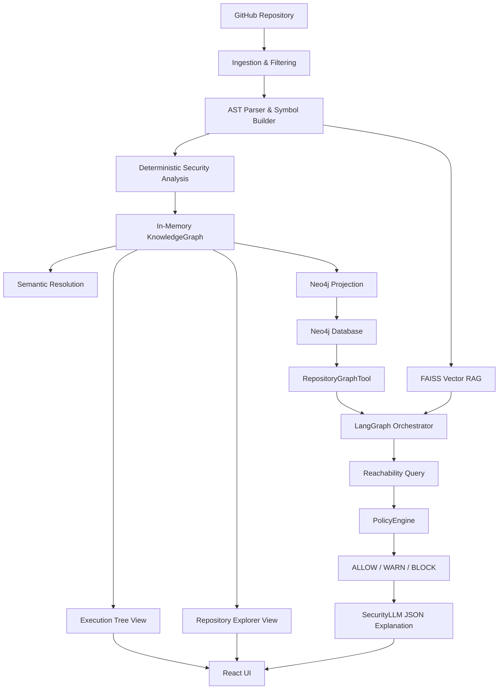

# AI Code Guardian: Engineering Evolution

## 1. Executive Summary

AI-Code-Guardian is an AI-assisted code security analysis platform. It combines deterministic static analysis, repository intelligence, graph analysis, semantic retrieval, bounded AI orchestration, and deterministic security policy evaluation.

The system intentionally separates reasoning layers to ensure security decisions are auditable, deterministic, and accurate:
```
Deterministic evidence
        ↓
Graph/topology reasoning
        ↓
Policy decision
        ↓
LLM explanation
```
A key design principle of this architecture is that the **LLM is NOT the final authority for security decisions**. The deterministic engine evaluates rules, the KnowledgeGraph understands the topology, the PolicyEngine determines the enforcement action (`ALLOW` / `WARN` / `BLOCK`), and the LangGraph-orchestrated LLM is strictly scoped to *explain* the vulnerability and generated fixes.

## 2. ORIGINAL ARCHITECTURE

Before recent architectural evolutions, the system followed a straightforward extraction-to-LLM pipeline:

```
Repository
   ↓
GitHub ingestion (services/analysis_service.py)
   ↓
Parser (scanner/parser.py, scanner/symbol_builder.py)
   ↓
Security analysis
   ↓
KnowledgeGraph (scanner/intelligence/knowledge_graph.py)
   ↓
Semantic resolution (scanner/intelligence/semantic_resolver.py)
   ↓
Execution Tree / Repository Explorer (scanner/intelligence/tree_service.py)
   ↓
RAG (ai/rag_pipeline.py)
   ↓
SecurityLLM / AI actions (ai/assistant.py, ai/strategies.py)
   ↓
React UI (ui/src/App.jsx)
```

**Major Components:**
- **Parser & Symbol Builder (`scanner/parser.py`, `scanner/symbol_builder.py`)**: Traversed source code via AST (tree-sitter) to extract classes, functions, calls, and imports.
- **KnowledgeGraph (`scanner/intelligence/knowledge_graph.py`)**: Built an in-memory graph representation of the repository's deterministic symbols.
- **Semantic Resolver (`scanner/intelligence/semantic_resolver.py`)**: Attempted to connect cross-file function calls and imports.
- **ExecutionBuilder & TreeService (`scanner/intelligence/tree_service.py`)**: Flattened graph connections into hierarchical trees for UI rendering.
- **AnalysisService (`services/analysis_service.py`)**: Orchestrated the initial pipeline upon ingestion.
- **API (`api/analysis.py`)**: Served REST endpoints to the frontend.
- **RAG & AI (`ai/rag_pipeline.py`, `ai/assistant.py`)**: Encapsulated LLM calls and FAISS vector retrieval to act on findings.

## 3. BASELINE VALIDATION

Before implementing major architectural changes, a baseline instrumentation of the system was performed. This was necessary to distinguish between **actual analysis/traversal loss** in the backend and **UI serialization/rendering problems** in the frontend.

**Pipeline Consistency Verified:**
1. **Execution Tree Pipeline**: `ExecutionTreeBuilder` → `TreeService` → `AnalysisService` → API response → React state/props → Rendered tree.
2. **Repository Explorer Pipeline**: `KnowledgeGraph` → `TreeService` → `AnalysisService` → API response → React state/props → Rendered Explorer.

During this validation, a critical discovery was made regarding file ingestion: modern frontend `.jsx` files were being excluded from the AST parsing entirely because JavaScript/JSX mappings were misconfigured. This fundamentally blocked repository traversal for frontend applications.

## 4. PROBLEM DISCOVERY & ROOT CAUSES

| Problem | Root Cause | Impact | Resolution |
|---|---|---|---|
| `.jsx` files excluded | `parser.py` missing `.jsx` to `javascript` mapping | Incomplete KnowledgeGraph, missing frontend findings | Added `.jsx` to language extension maps in `scanner/parser.py` |
| AI action 500 crashes | `InvestigationSession` lacked robust validation | Broken chat / fix actions when context was missing | Added session validation and graceful fallback in `api/analysis.py` |
| UI Markdown crashes | ReactMarkdown received object dicts instead of strings | Complete frontend UI crash | Implemented `safeMarkdown` utility in `ChatPanel.jsx` |
| Arbitrary graph queries | Lack of typed Neo4j querying boundaries | Potential security/Cypher injection risks | Avoided generic Cypher; implemented strictly typed `Neo4jAdapter` methods |
| No API Endpoint detection | AST parser didn't extract framework routing metadata | Could not identify external attack surfaces | Enriched `SymbolBuilder` to extract FastAPI decorators and HTTP methods |
| No Deterministic Reachability | In-memory graph lacked robust multi-hop pathfinding | Cannot prove a vulnerability is externally reachable | Introduced Neo4j projection and bounded Cypher traversal (`max_depth=10`) |
| LLM-driven Policy Decisions | AI prompts were instructed to decide ALLOW/WARN/BLOCK | Hallucinated decisions, un-auditable security | Built deterministic `PolicyEngine` to enforce matrix rules prior to LLM |

## 5. INGESTION AND REPOSITORY ANALYSIS

The final repository ingestion flow behaves as follows:
1. **GitHub Ingestion**: Fetches files securely via the GitHub API (or local Zip handling).
2. **File Filtering**: Only source code files are parsed.
3. **Parsing**: `tree-sitter` generates ASTs per language.
4. **Security Scanning**: Rules are matched against the parsed files.
5. **KnowledgeGraph Construction**: Nodes and edges are created.

**The `.jsx` Fix**: 
Previously, `.jsx` files were skipped by the parser because the extension mapping only recognized `.js`. This was a severe ingestion issue because the `TreeService` could not render trees for files that were never parsed. Adding `.jsx` support in `scanner/parser.py` completely restored React repository traversal.

## 6. KNOWLEDGEGRAPH

The `KnowledgeGraph` serves as the **deterministic source of truth** for the system. It is generated purely from static source code analysis.

**Verified Nodes:**
`Repository`, `File`, `Folder`, `Class`, `Function`, `Call`, `Import`, `Finding`, `Capability`, `Rule`

**Verified Relationships:**
`CONTAINS`, `EXECUTES`, `IMPORTS`, `GENERATES_FINDING`, `HAS_CAPABILITY`, `MATCHES_RULE`, `RESOLVES_TO`, `ROUTES_TO`, `CALLS`

The architecture relies heavily on the KnowledgeGraph, but uses **Neo4j** as a queryable projection. The in-memory KnowledgeGraph builds the truth; Neo4j projects it to answer complex graph queries.

## 7. EXECUTION TREE AND REPOSITORY EXPLORER

Baseline analysis revealed that these two UI panels are projections of different fundamental concepts:
- **Repository Explorer**: A structural, hierarchical filesystem view.
- **Execution Tree**: A semantic, control-flow view detailing how functions call other functions and eventually reach findings.

The `TreeService` was verified to successfully transform the flat KnowledgeGraph edges into nested JSON structures necessary for the React frontend, maintaining click-to-inspect interactivity.

## 8. RAG

Retrieval-Augmented Generation (RAG) is implemented via FAISS vector indexing. 
- It embeds source code and documentation.
- It is heavily utilized by free-text chat and AI actions (like Generate Fix) to provide deep semantic context.
- **Critical Boundary**: RAG provides contextual retrieval. It **does NOT** determine the security policy decision. It only gives the LLM the context needed to explain the decision.

## 9. LANGGRAPH

Previously, AI actions followed a linear, monolithic flow (`RAGPipeline` → `StrategyFactory` → LLM). This was rigid and prone to context overflow or missing information.

LangGraph was introduced as a **bounded orchestrator** for AI investigations. 

**Final Orchestrated Graph:**
```
START
  ↓
route_action
  ↓ (Conditional Fan-out)
evidence_node  +  graph_tool_node  +  semantic_search_node
  ↓ (Fan-in)
policy_node
  ↓
reasoning_node
  ↓
END
```
**Responsibilities:**
- `evidence_node`: Fetches deterministic finding details.
- `graph_tool_node`: Queries Neo4j for reachability and topology.
- `semantic_search_node`: Performs RAG lookups.
- `policy_node`: Runs the deterministic `PolicyEngine`.
- `reasoning_node`: Executes the final `SecurityLLM` prompt.

LangGraph is solely an orchestrator. It does not replace the Parser, KnowledgeGraph, SemanticResolver, ExecutionTreeBuilder, RAG, Neo4j, or PolicyEngine.

## 10. NEO4J

The in-memory KnowledgeGraph is highly performant for deterministic analysis but lacks advanced persistent graph-query capabilities (e.g., finding the shortest path across 10 hops).

**Architecture:**
`KnowledgeGraph` → `Neo4jAdapter` → `Neo4j` → `RepositoryGraphTool` → `LangGraph`

The projection ensures that a **repository namespace** isolates graphs per repository. Cypher queries are tightly controlled through domain-specific methods in `Neo4jAdapter` (e.g., `get_finding_reachability`), intentionally avoiding arbitrary LLM-generated Cypher to prevent injection vulnerabilities.

**Runtime Verification Evidence:**
Testing against the real repository achieved exactly **887 nodes** and **1064 relationships**, mirroring the in-memory graph perfectly. Graceful degradation was also verified: if the Neo4j driver fails to connect, the `RepositoryGraphTool` returns a controlled error to LangGraph, which proceeds without crashing the UI.

## 11. API ENDPOINT DETECTION

The graph knew about functions, but not which ones were externally exposed via HTTP. We enriched the `SymbolBuilder` to extract FastAPI decorators.

**Implementation**:
The AST parser looks for `@app.get`, `@router.post`, etc., and adds `is_api_endpoint`, `http_method`, and `route` properties to the `Function` node. 

**Verified:**
- Total Functions: 102
- API endpoint Functions: 5

## 12. REACHABILITY ANALYSIS

With API endpoints known, we can answer the ultimate security question:
*"Can this vulnerable function be reached from an API endpoint?"*

**Traversal Path:**
```
Finding
    ↓
vulnerable Function
    ↑
CALLS / EXECUTES
    ↑
ancestor Functions
    ↑
API endpoint
```
This traversal is executed via a deterministic Cypher query in `Neo4jAdapter` with a strict `max_depth=10`. Bounded traversal prevents infinite loops in recursive code and limits query execution time. The LLM is explicitly excluded from determining reachability—it is a purely mathematical graph property.

## 13. DETERMINISTIC POLICY ENGINE

The `PolicyEngine` evaluates the severity of the finding combined with the deterministic reachability result to produce a final security decision.

**Matrix Rules (`ai/policy_engine.py`):**
- LOW + unreachable       → **ALLOW**
- MEDIUM + unreachable    → **ALLOW**
- LOW + reachable         → **WARN**
- MEDIUM + reachable      → **WARN**
- HIGH + unreachable      → **WARN**
- CRITICAL + unreachable  → **WARN**
- HIGH + reachable        → **BLOCK**
- CRITICAL + reachable    → **BLOCK**

This decision logic fundamentally belongs in deterministic Python code. Security rules must be auditable, testable, and guaranteed, none of which are possible if an LLM guesses the outcome.

## 14. LLM SAFETY / AUTHORITY BOUNDARY

To guarantee that the LLM cannot override the deterministic policy engine, an explicit safety boundary was enforced in `langgraph_orchestrator.py`:

```python
# PROVE LLM CANNOT OVERRIDE
# Enforce deterministic policy authority in code
if state.get("policy_decision"):
    result.policy_decision = state.get("policy_decision")
```
During testing, a `MockLLM` was rigged to output `{"decision": "ALLOW"}` for a HIGH-severity reachable finding. The python orchestrator intercepted the payload and correctly superseded the LLM, reverting the payload to `BLOCK`. This provides absolute architectural authority to the `PolicyEngine`.

## 15. ERROR HANDLING AND FAILURE MODES

Error handling was upgraded across the stack to ensure the UI gracefully handles missing data instead of crashing:
- **Missing Neo4j**: The adapter returns `Neo4j driver unavailable`. The `policy_decision` and `reachability` panels in the React UI simply hide themselves.
- **AI Action Failures**: If LangGraph fails or the LLM hallucinates unparseable JSON, a controlled `InvestigationResult` containing the string error is returned. The UI renders this safely.
- **React Markdown Crashes**: Previously, passing an object to `ReactMarkdown` crashed the DOM. A `safeMarkdown` utility now stringifies complex objects safely.
- **Missing Session**: `api/analysis.py` validates `session` existence, returning graceful HTTP 400s instead of throwing internal 500 server errors.

## 16. FINAL ARCHITECTURE


