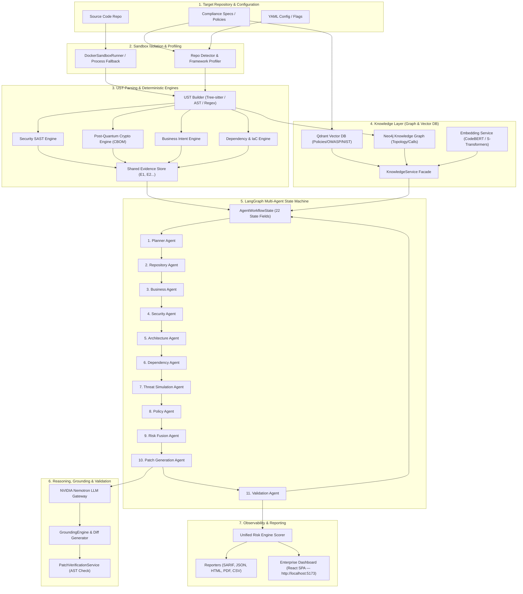

# AI Code Guardian — High-Level End-to-End Architecture & System Design

> **AI Code Guardian** is a multi-language, UST-driven, evidence-grounded code analysis, security auditing, post-quantum cryptography (PQC) readiness checking, business-intent compliance, multi-agent reasoning, and automated remediation platform.

---

## 1. Executive Summary & Core Philosophy

AI Code Guardian unifies **deterministic static analysis**, **syntax-tree normalization (UST)**, **knowledge-graph topology**, **vector RAG context**, **multi-agent LLM reasoning (via NVIDIA Nemotron)**, **evidence-grounded remediation**, and **enterprise observability** into an integrated, end-to-end security platform.

### Core Architectural Principles

1. **Deterministic Detection Stays Deterministic**: No AI model decides whether a vulnerability exists. Parsing rules, taint dataflow analysis, and the **Unified Syntax Tree (UST)** perform deterministic evidence gathering; AI models are strictly reserved for contextual reasoning, impact synthesis, threat modeling, and patch proposal drafting.
2. **Strict Evidence Grounding & Anti-Hallucination Guardrails**: Every finding and patch proposal cites immutable, stable Evidence IDs (e.g., `E1`, `E2`). Any AI claim citing non-existent evidence, invalid line numbers, or contradicting the syntax tree is automatically rejected by strict grounding engines.
3. **Graceful Partial Degradation**: Missing language grammars, unreachable vector/graph databases, or disabled LLM APIs degrade only the affected stage. The scan automatically cascades down a degradation ladder (Tree-sitter $\rightarrow$ stdlib AST $\rightarrow$ regex fallback) to produce valid partial results without crashing.
4. **Read-Only Safety & Mechanical Validation**: Repository analysis, threat modeling, and patch generation operate in read-only mode or inside isolated sandboxes. Generated remediation patches are verified mechanically using AST syntax checks and re-scan rules before developer presentation.
5. **Single Source of Truth Workflow Memory**: All 10 specialist agents coordinate through a shared, strongly-typed state machine (`AgentWorkflowState`) managed by a LangGraph orchestrator.

---

## 2. High-Level System Architecture & Flow

The overall architecture spans seven major subsystems operating across an end-to-end multi-agent pipeline:



---

## 3. Subsystem Architectural Breakdown (Phases 1 – 7)

### Subsystem 1: Safe Sandbox Isolation & Profiling (Phase 1)
* **Core Modules**: [`guardian/sandbox/config.py`](file:///Users/prajwalkajale/Documents/acg2/guardian/sandbox/config.py), [`guardian/sandbox/docker_runner.py`](file:///Users/prajwalkajale/Documents/acg2/guardian/sandbox/docker_runner.py), [`guardian/discovery/repo_detector.py`](file:///Users/prajwalkajale/Documents/acg2/guardian/discovery/repo_detector.py)
* **Functionality**:
  - Enforces CPU caps (2.0 cores), memory limits (4GB), read-only mounts (`:ro`), and network isolation (`--network=none`).
  - Automatic environment variable sanitization redacting AWS keys, OpenAI/Nemotron credentials, and DB connection secrets before executing subprocesses.
  - Profile detection identifies entry points, framework signatures (FastAPI, Django, Spring Boot, Express, Axum), public API endpoints, database operations, and high-risk file paths.

### Subsystem 2: Unified Syntax Tree (UST) & Deterministic Engine Array (Phases 1 & 2)
* **Core Modules**: [`guardian/ust/`](file:///Users/prajwalkajale/Documents/acg2/guardian/ust/), [`guardian/engines/`](file:///Users/prajwalkajale/Documents/acg2/guardian/engines/), [`guardian/evidence/`](file:///Users/prajwalkajale/Documents/acg2/guardian/evidence/)
* **Functionality**:
  - **Multi-Language Parsing**: Uses Tree-sitter bindings for Python, Java, JavaScript, TypeScript, and Rust to build a standardized `USTNode` tree with cross-language semantic tags (`crypto_operation`, `security_gate`, `database_call`, `entry_point`).
  - **Taint Analysis**: Inter-procedural source-to-sink taint propagation (`guardian/ust/dataflow.py`) tracks untrusted user inputs flowing into dangerous sinks.
  - **Shared Evidence Store**: Centralized store ([`guardian/evidence/store.py`](file:///Users/prajwalkajale/Documents/acg2/guardian/evidence/store.py)) assigning immutable Evidence IDs (`E1`, `E2`, ...) and code location fingerprints to prevent duplicate scoring across engines.
  - **Engines**:
    - **Security SAST Engine**: SQLi, XSS, Command Injection, Secrets, Path Traversal.
    - **Post-Quantum Cryptography Engine**: Layer A discovery, Layer B NIST FIPS 203/204/205 classification, Cryptographic Bill of Materials (CBOM) generation.
    - **Business Intent Engine**: Evaluates code behavior against required business control policies.
    - **Dependency & IaC Engine**: Manifest parsing (`requirements.txt`, `pom.xml`, `package.json`, `Cargo.toml`) cross-referenced with CVE databases.

### Subsystem 3: Shared Knowledge Layer (Vector DB & Knowledge Graph) (Phase 2)
* **Core Modules**: [`guardian/knowledge/embeddings/`](file:///Users/prajwalkajale/Documents/acg2/guardian/knowledge/embeddings/), [`guardian/knowledge/qdrant/`](file:///Users/prajwalkajale/Documents/acg2/guardian/knowledge/qdrant/), [`guardian/knowledge/graph/`](file:///Users/prajwalkajale/Documents/acg2/guardian/knowledge/graph/), [`guardian/knowledge/services/knowledge_service.py`](file:///Users/prajwalkajale/Documents/acg2/guardian/knowledge/services/knowledge_service.py)
* **Functionality**:
  - **Semantic Vector Store (Qdrant)**: Embeds and indexes compliance specifications, security policies, OWASP top 10, NIST standards, and code documentation using Sentence Transformers / CodeBERT.
  - **Structural Knowledge Graph (Neo4j)**: Stores structural relationship nodes (`Repository`, `File`, `Class`, `Function`, `Endpoint`, `Dependency`) and edges (`CONTAINS`, `IMPORTS`, `CALLS`, `DEPENDS_ON`, `EXPOSES`).
  - **KnowledgeService Facade**: Abstract access layer shielding multi-agent workflows from direct database drivers, enabling in-memory fallback during offline execution.

### Subsystem 4: LangGraph Orchestration & Shared Workflow Memory (Phase 3)
* **Core Modules**: [`guardian/orchestrator/state.py`](file:///Users/prajwalkajale/Documents/acg2/guardian/orchestrator/state.py), [`guardian/orchestrator/langgraph_flow.py`](file:///Users/prajwalkajale/Documents/acg2/guardian/orchestrator/langgraph_flow.py), [`guardian/orchestrator/events.py`](file:///Users/prajwalkajale/Documents/acg2/guardian/orchestrator/events.py), [`guardian/orchestrator/tools.py`](file:///Users/prajwalkajale/Documents/acg2/guardian/orchestrator/tools.py)
* **Functionality**:
  - **Single Source of Truth State (`AgentWorkflowState`)**: Dataclass carrying repository context, business context, security findings, evidence objects, threat models, policy evaluations, risk profiles, patch proposals, execution traces (`AgentTrace`), and performance metrics (`ExecutionMetrics`).
  - **Pub/Sub Event Bus**: Emits real-time workflow lifecycle events (`WorkflowStarted`, `TaskScheduled`, `FindingCreated`, `WorkflowCompleted`).
  - **Tool Registry**: Strongly-typed system tools passed to specialist agents (`KnowledgeTool`, `EvidenceTool`, `RiskTool`, `ValidationTool`).

### Subsystem 5: Multi-Agent Specialist Analysis Array (Phases 4 & 5)
* **Core Modules**: [`guardian/agents/`](file:///Users/prajwalkajale/Documents/acg2/guardian/agents/)
* **Specialist Agent Workflow Order**:

```
[START] ──► PlannerAgent
               │
               ▼
         RepositoryAgent ──► BusinessAgent ──► SecurityAgent ──► ArchitectureAgent
               │
               ▼
         DependencyAgent ──► ThreatSimulationAgent ──► PolicyAgent ──► RiskFusionAgent
               │
               ▼
         PatchGenerationAgent ──► ValidationAgent ──► [END]
```

1. **Planner Agent**: Analyzes repository profile and policies to build a dynamic `ExecutionPlan`.
2. **Repository Agent**: Maps directory trees, framework routing, entry points, and high-risk modules into `repository_context`.
3. **Business Agent**: Classifies domain (Fintech, Healthcare, E-commerce), business criticality, and asset value into `business_context`.
4. **Security Agent**: Executes deterministic rule scanners, binds Evidence IDs, and populates `security_context`.
5. **Architecture Agent**: Queries graph topology to determine call graphs, trust boundaries, and component relationships in `architecture_context`.
6. **Dependency Agent**: Audits manifest files for vulnerable third-party packages into `dependency_context`.
7. **Threat Simulation Agent**: Evaluates exploitability, reachability, attack paths, authentication bypasses, and data exposure strictly grounded in Evidence IDs.
8. **Policy Agent**: Loads compliance frameworks (OWASP, NIST, PCI-DSS) via `PolicyPackManager` and maps finding violations.
9. **Risk Fusion Agent**: Computes technical, business, threat, and policy risk scores into a composite multi-dimensional risk profile.

### Subsystem 6 & 7: Remediation & Grounded Validation Engine (Phase 6)
* **Core Modules**: [`guardian/agents/patch/`](file:///Users/prajwalkajale/Documents/acg2/guardian/agents/patch/), [`guardian/agents/validation/`](file:///Users/prajwalkajale/Documents/acg2/guardian/agents/validation/), [`guardian/reasoning/grounding/`](file:///Users/prajwalkajale/Documents/acg2/guardian/reasoning/grounding/)
* **Functionality**:
  - **Patch Generation Agent**: Drafts targeted fix proposals (`PatchProposal`) using specialized LLM prompts for SQLi, XSS, Command Injection, Weak Crypto, and Secrets.
  - **Grounding Engine**: Verifies that proposed patches target real file paths, valid line numbers, existing finding IDs, and known Evidence IDs. Rejects hallucinated fixes.
  - **Git Diff Generator**: Computes standard Unified Git Diffs without modifying files on disk.
  - **Patch Verification Service**: Applies replacement snippets in temporary AST memory and re-executes `SecurityRuleEngine` to mechanically verify finding elimination.

### Subsystem 8: Enterprise Observability & Dashboard Layer (Phase 7)
* **Core Modules**: [`guardian/dashboard/`](file:///Users/prajwalkajale/Documents/acg2/guardian/dashboard/)
* **Functionality**:
  - **React (Vite + TypeScript) SPA** (`frontend/`) consuming the FastAPI backend REST/SSE API.
  - **10 Interactive View Pages**:
    1. *Repository Overview*: Project stack, entry points, API route summary.
    2. *Knowledge Graph Page*: Visualizes Neo4j structural topology via `KnowledgeService`.
    3. *Workflow Execution Timeline*: Visualizes agent execution durations and status sequence.
    4. *Agent Trace Explorer*: Inspects agent inputs, outputs, tools called, confidence scores, and reasoning logs.
    5. *Evidence Explorer*: Cross-references Evidence IDs with findings, code lines, and policies.
    6. *Risk Dashboard*: Renders composite risk radar charts and top critical findings.
    7. *Patch Explorer*: Side-by-side code diff viewer, git diff output, and developer explanations.
    8. *Validation Dashboard*: Displays syntax check results and mechanical re-verification status.
    9. *Operational Metrics*: Renders query durations, embedding latencies, and agent runtimes.
    10. *Export Center*: Unified portal for downloading SARIF, JSON, HTML, PDF, CSV, Patch Bundles, and Execution Traces.

---

## 4. End-to-End Data Processing Flow

An end-to-end scan follows an 11-step execution sequence:

```
Step 01: CLI / API Request ──► User invokes scan command or REST API endpoint.
Step 02: Sandbox Prep     ──► Isolated temporary workspace created (native process, no containers).
Step 03: Profile & Detect ──► RepoDetector identifies framework, entry points, public routes.
Step 04: UST Parsing      ──► Tree-sitter normalizes source files into unified UST AST nodes.
Step 05: Engine Detection ──► Deterministic SAST, PQC, Policy & Dependency engines run.
Step 06: Evidence Indexing──► Findings & observations indexed with stable Evidence IDs (E1, E2...).
Step 07: Knowledge Sync   ──► Code topology synced to Neo4j; policies synced to Qdrant.
Step 08: Agent Execution  ──► LangGraph triggers 10 specialist agents sequentially.
Step 09: Patch & Verify   ──► AI generates fix proposals; AST verification re-checks code safety.
Step 10: Risk Scoring     ──► Multi-Dimensional Unified Risk Engine calculates composite score.
Step 11: Export & View    ──► Reports generated (SARIF, HTML, PDF); Dashboard UI rendered.
```

---

## 5. Verification & Quality Assurance Summary

The entire platform is backed by a comprehensive automated test suite consisting of **445 passed unit and integration tests (Phase 4 baseline)**:

```bash
python -m pytest tests/ -q
# Output: 445 passed, 1 skipped in ~365s
```

* **Test Coverage Highlights**:
  - `test_sandbox.py`: Isolated container execution & secret redaction.
  - `test_knowledge.py`: Qdrant vector indexing, Neo4j graph queries, embedding cache.
  - `test_orchestrator.py`: StateGraph transitions, EventBus, ToolRegistry.
  - `test_phase4.py`: Core specialist agents (Repository, Business, Security, Architecture, Dependency).
  - `test_phase5.py`: Collaborative intelligence (Threat Simulation, Policy, Risk Fusion, Evidence Correlation).
  - `test_phase6.py`: Patch proposal generation, grounding engine, git diffs, AST re-verification.
  - `test_phase7.py`: Dashboard state views, pages, components, charts, export center.

---

## 6. Project Directory Map

```
AI-Code-Guardian/
├── Architecture.md                     <-- High-level system architecture specification
├── END_TO_END_SYSTEM_DESIGN.md         <-- Detailed end-to-end system design (mirror)
├── README.md                           <-- Overview and Quick Start Guide
├── pyproject.toml / requirements.txt   <-- Build configuration & dependencies
├── backend/                            <-- FastAPI REST API Backend
├── frontend/                           <-- React (Vite + TypeScript) SPA Dashboard
├── guardian/                           <-- Core Python Platform Engine
│   ├── agents/                         <-- Specialist Multi-Agent Array (Phases 4 & 5)
│   │   ├── base/                       <-- BaseAgent & AgentResult models
│   │   ├── shared/                     <-- Strongly-typed context objects & consensus
│   │   ├── repository/                 <-- RepositoryAgent
│   │   ├── business/                   <-- BusinessAgent
│   │   ├── security/                   <-- SecurityAgent
│   │   ├── architecture/               <-- ArchitectureAgent
│   │   ├── dependency/                 <-- DependencyAgent
│   │   ├── threat_simulation/          <-- ThreatSimulationAgent
│   │   ├── policy/                     <-- PolicyAgent
│   │   ├── risk/                       <-- RiskFusionAgent
│   │   ├── patch/                      <-- PatchGenerationAgent (Phase 6)
│   │   └── validation/                 <-- ValidationAgent (Phase 6)
│   ├── dashboard/                      <-- Enterprise Observability UI (Phase 7)
│   │   ├── app.py                      <-- Legacy Streamlit app (superseded by React frontend)
│   │   ├── components/                 <-- Navigation & Code Diff viewers
│   │   ├── charts/                     <-- Risk & Timeline Chart Generators
│   │   ├── models/                     <-- DashboardStateView model
│   │   └── pages/                      <-- 10 Dashboard Page implementations
│   ├── discovery/                      <-- Repo walker & framework detector
│   ├── engines/                        <-- SAST, PQC, & Business Intent engines
│   ├── evidence/                       <-- Shared Evidence Store & Correlation Service
│   ├── knowledge/                      <-- Vector DB (Qdrant), Graph (Neo4j), Embeddings
│   ├── llm/                            <-- NVIDIA Nemotron LLM gateway & patch prompts
│   ├── orchestrator/                   <-- LangGraph workflow, state, events, tools
│   ├── policies/                       <-- Policy Pack Manager (YAML/JSON policies)
│   ├── quantum/                        <-- CBOM generator & NIST PQC classifier
│   ├── reasoning/                      <-- Context budget manager & Grounding Engine
│   ├── reporting/                      <-- SARIF, JSON, HTML, PDF, CSV reporters
│   ├── sandbox/                        <-- Process isolation sandbox (Docker opt-in via --sandbox flag)
│   └── ust/                            <-- Unified Syntax Tree & Tree-sitter parsers
├── docs/                               <-- System & Phase Documentation
│   └── phases/                         <-- Phase 1 through Phase 7 Migration Specs
└── tests/                              <-- Comprehensive Pytest Suite (434+ tests)
```
